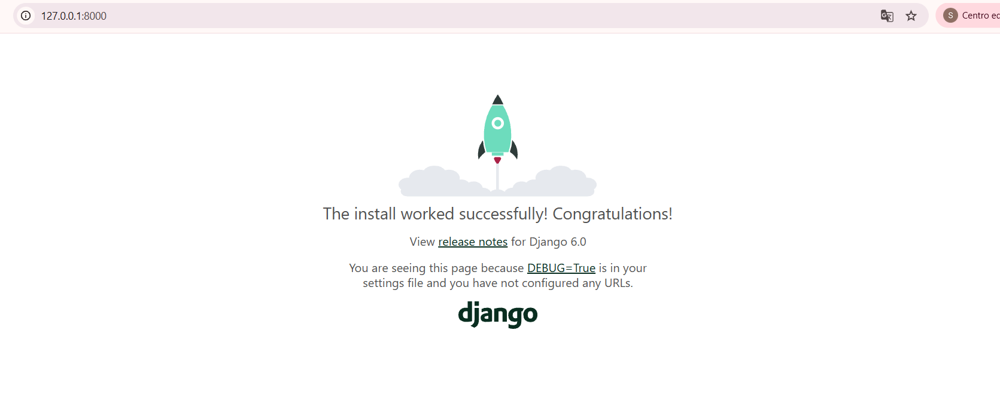
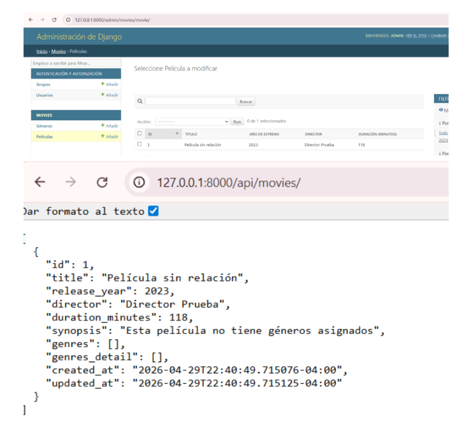
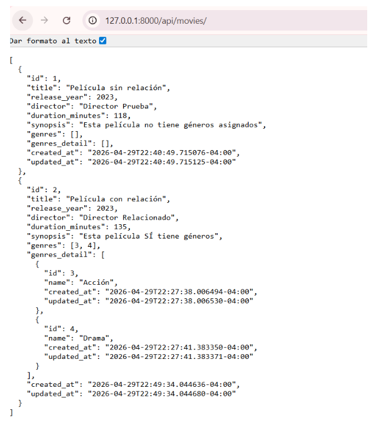
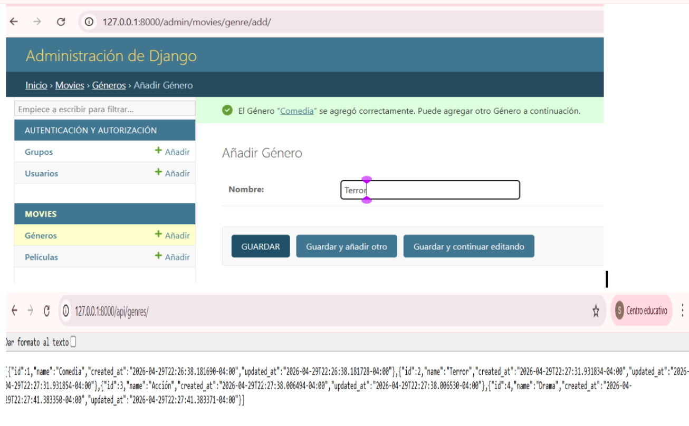
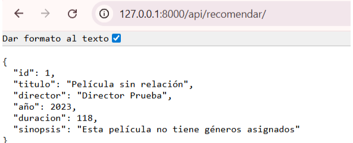
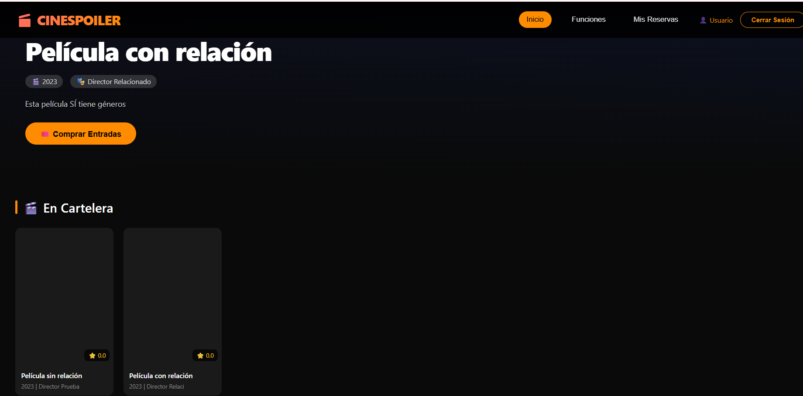
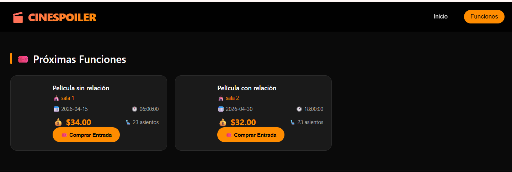
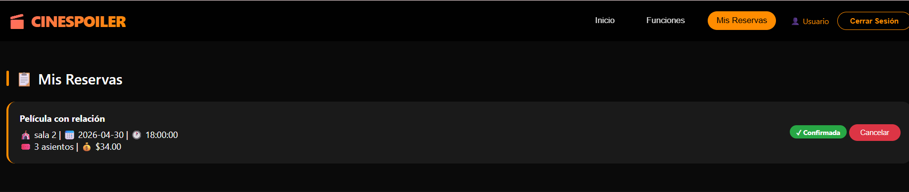

# 🎬 CINESPOILER - API DE CINE

API REST para la gestión de cine desarrollada con Django REST Framework.
Permite administrar películas, géneros, salas, funciones y reservas.

---

## 📸 Capturas principales

1. **Proyecto levantado**
	
2. **Película SIN relación**
	
3. **Película CON relación**
	
4. **Creando géneros y endpoint**
	
5. **Endpoint agregado (recomendar)**
	
6. **Cartelera de películas**
	
7. **Funciones**
	
8. **Reservas**
	

---

## 🚀 Cómo ejecutar el proyecto

1. Abrir terminal en la raíz del proyecto
2. Activar entorno virtual:
	```bash
	venv\Scripts\activate
	```
3. Entrar al proyecto:
	```bash
	cd cinespoiler
	```
4. Ejecutar servidor:
	```bash
	python manage.py runserver
	```
5. Abrir navegador en: [http://127.0.0.1:8000/](http://127.0.0.1:8000/)

---

## 🌐 Endpoints principales

**Públicos:**
- `GET /api/movies/` → Listar películas
- `GET /api/genres/` → Listar géneros
- `GET /api/recomendar/` → Recomendar película ⭐

**Protegidos (requieren token):**
- `POST /api/token/` → Login (obtener token)
- `GET /api/bookings/` → Ver reservas

---

## 📄 Notas

- Todas las capturas fueron tomadas directamente del navegador.
- Para más detalles y explicaciones de cada endpoint, consulta la carpeta [`cinespoiler/docs/`](cinespoiler/docs/).

---

Desarrollado por: *Tu Nombre Aquí*
